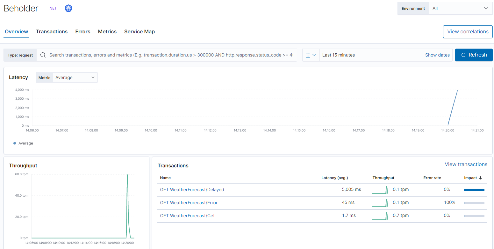

# beholder
"It observes everything"

Just another sample project focused on observability on .NET with Elastic stack.


## Getting started

On project root folder, run:
```sh
docker-compose up
``` 

The followings urls will be available:

- Kibana http://localhost:5601/
- Beholder App Sample - https://localhost:5001/swagger/index.html

Try out the swagger enpoint execution and see the metrics on kibana.




## TODO

- [ ] Serilog Elastic Formatter
- [ ] FluentD


## Useful links

https://www.elastic.co/guide/en/apm/agent/dotnet/current/config-reporter.html

https://devblogs.microsoft.com/aspnet/monitoring-and-observability-in-cloud-native-asp-net-core-apps/

https://andrewlock.net/writing-logs-to-elasticsearch-with-fluentd-using-serilog-in-asp-net-core/